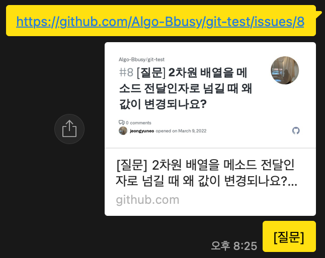

# learn-more

Question &amp; Answer &amp; Sharing

## 📌 스터디 규칙

1. 모르는 것에 창피함은 없다. 모르는 건 질문하자.
2. 틀려도 좋다. 자신있게 답변하자.
3. 반문 또한 좋은 자원이다. 의문이 생기면 질문하자.
4. 공유하며 성장하자.

## 📎 제출 양식

### 질문

- Issue

  제목 : [질문] 질문 내용

  라벨 : Question + 질문 키워드

- PR

  제목 : [질문] 질문 내용

  라벨 : Question + 질문 키워드

  브랜치명 : 본인이니셜

  파일명

    1. 알고리즘 - Algo_문제출처_문제번호_문제이름_질문자이름

       ex) Algo_BOJ_1541_잃어버린괄호_어정윤.java

    2. 구현 - Impl_분류_질문자이름

       ex) Impl_Frontend_어정윤.js

  폴더 - Question

    1. 알고리즘

    2. 구현 - 여러 개의 파일일 경우 파일명에 맞춰 폴더 생성 후 폴더 내에 파일 업로드

### 답변

- Issue or PR에 comment

### 공유

- PR

  폴더 - Knowledge

    1. 알고리즘
    2. 해당 언어
    3. 프레임워크

       ...

       등 해당 카테고리 폴더 내에 파일 생성(폴더 생성은 카톡으로 건의)

       이미 있는 파일에 내용을 추가하고 싶을 경우 파일을 수정해 PR을 날린다.

### 카톡방 공유

링크 + [분류]

- [질문]
- [답변완료]
- [공유]

> 건의사항은 카톡방으로!
